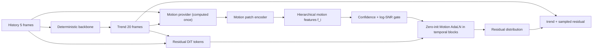

# DiffCast GlobalNet 与 Motion-conditioned DiT 调研及短消融报告

日期：2026-08-11  
任务：评估 DiffCast GlobalNet 对“确定性骨干 + residual DiT”的价值，并研究如何把 motion 信息稳定地注入概率扩散模型。  
实验服务器：`weather_debug`，`tmux:wzq`，环境 `/test1/wzq/envs/PhyRD`。

## 1. 结论先行

### 1.1 GlobalNet 有用，但不适合原样作为最终创新点

DiffCast 的 GlobalNet 确实有效。论文在 SEVIR 上移除 GlobalNet 后，SimVP、Earthformer、PhyDNet 三种 backbone 的 CSI 都下降。它说明“确定性预测中包含的全局运动信息应该进入概率残差模型”，这个原则是可靠的。

但是，当前 PhyRD 的 Temporal Residual DiT 已经在每个空间 patch 上 cross-attend 全部 history 与 deterministic trend token。直接再搬一套 GlobalNet，会较大程度重复“读取趋势序列”的功能；而且 GlobalNet 给的是隐式 ConvGRU hidden state，不是可解释的位移、轨迹或置信度。它适合做必要消融和低风险 baseline，不足以单独构成当前最强的论文主创新。

### 1.2 最推荐的主方案

推荐做一个 **Confidence-Gated Motion AdaLN（暂名 CG-MAdaLN）**：

1. 从 `history + deterministic trend` 一次性提取逐 lead motion patches；
2. 第一版先使用 GPU 原生的趋势差分、加速度和空间梯度，后续再加入显式 flow；
3. 用 zero-initialized AdaLN 把 motion patch 注入 DiT 的 temporal block；
4. 用 motion confidence 和 diffusion log-SNR 控制注入强度；
5. motion 只调制 hidden feature，不 hard-warp 最终预测；
6. motion feature 每个样本只计算一次，在全部 DDIM steps 中复用。

这个方案继承了 DiffCast 的“global motion prior”，但在表示和注入方式上更接近 ToRA，并针对降水预测补上了最关键的“不可靠运动置信度”。

### 1.3 当前短消融的定位

本报告中的 2k/2k 实验是 **motion 表示选择 probe**，不是完整 DiT SOTA 实验。三种 probe 共享同一个 patch-level residual stem、相同数据顺序、seed、优化器和训练步数，唯一变化是：

- baseline：没有额外时序 motion 分支；
- GlobalNet：patch-grid ConvGRU context；
- ToRA-AdaLN：显式 motion descriptor + zero-init AdaLN。

它用于决定下一版正式 DiT 应优先实现哪种 motion condition，不能替代完整 checkpoint 上的正式消融。

600-step、2048-sample `val_model` 的结果支持这个定位：原样 GlobalNet probe 相对无 motion baseline 的 MSE 增加 `2.46%`、CSI mean 下降 `0.89%`；ToRA-AdaLN probe 的 MSE 降低 `2.03%`、MAE 降低 `2.68%`、CSI mean 提升 `3.22%`。因此下一步应优先做 Motion AdaLN，不应把 GlobalNet 原样移植成主模型。与此同时，所有短训 residual probe 的 MSE/MAE 仍未超过纯 PhyDNet trend，说明该结果只完成了表示路线筛选，尚未证明正式概率模型已经提点。

## 2. 原版 DiffCast GlobalNet 到底是什么

### 2.1 代码位置与真实命名

官方 DiffCast 仓库中，论文所称的 GlobalNet 在代码里实际叫 `ContextNet`：

- 官方代码：`diffcast.py::ContextNet`
- `weather_debug` 镜像：`/test1/wzq/Weather/diffcast_new/models/diffcast.py`
- 官方仓库：[DeminYu98/DiffCast](https://github.com/DeminYu98/DiffCast)
- 论文：[DiffCast, CVPR 2024](https://openaccess.thecvf.com/content/CVPR2024/html/Yu_DiffCast_A_Unified_Framework_via_Residual_Diffusion_for_Precipitation_Nowcasting_CVPR_2024_paper.html)

它的核心结构是：

```text
history + deterministic forecast
        │ sequential scan
        ▼
7×7 input convolution
        ▼
ResNet block → ConvGRU → downsample       scale 1
ResNet block → ConvGRU → downsample       scale 2
ResNet block → ConvGRU → downsample       scale 3
ResNet block → ConvGRU                    scale 4
        │
        ├─ local multi-scale context
        └─ global multi-scale context
```

得到的多尺度 hidden states 会在 GTUNet 的对应 down block 与 feature map 做 channel concatenation。

### 2.2 它如何参与训练和推理

设确定性骨干输出为 `mu`，真实未来为 `y`，扩散学习残差 `r = y - mu`。GlobalNet 扫描 `history + mu` 后提供：

- 第一段 residual 使用较早的 local context；
- 后续 residual segments 使用扫描完整趋势后的 global context；
- residual segment 之间仍采用自回归条件。

因此 GlobalNet 不是第二个未来预测器，也不是显式 optical flow。它是一个 **把确定性趋势压成多尺度时空上下文的条件编码器**。

### 2.3 论文消融证据

DiffCast 论文 Table 4 的 SEVIR 结果如下：

| Backbone | 完整 DiffCast CSI | 去掉 GlobalNet CSI | 绝对下降 |
|---|---:|---:|---:|
| SimVP | 0.3077 | 0.2719 | -0.0358 |
| Earthformer | 0.2823 | 0.2558 | -0.0265 |
| PhyDNet | 0.2757 | 0.2648 | -0.0109 |

这证明 GlobalNet 在 DiffCast 的 U-Net residual diffusion 中有效，但不能直接证明它在当前已经显式读取全序列 trend token 的 DiT 中仍有同等增益。

## 3. 当前 Temporal Residual DiT 已有与缺少的内容

当前实现位于：

- `src/phyrd/models/probabilistic/temporal_residual_dit/denoiser.py`
- `src/phyrd/models/probabilistic/temporal_residual_dit/blocks.py`

它已经具备：

1. `[B,T,N,D]` 的显式 future-lead tokens；
2. spatial attention；
3. lead-time temporal attention；
4. 每个空间 patch 对全部 history + trend leads 的 cross-attention；
5. diffusion timestep 与 lead embedding；
6. pixel-space high-frequency correction head。

它缺少：

1. 显式 motion vector / trajectory representation；
2. motion reliability 或 forward-backward confidence；
3. 将运动与非平流强度变化解耦的表示；
4. 针对不同 diffusion SNR 的 motion gate；
5. 在 temporal block 内专门面向 motion 的 feature modulation。

因此，仅把 GlobalNet hidden state再作为一组 cross-attention context，和当前 context path 的功能重合较大；更值得补的是“motion 表示 + motion 专用融合”。

## 4. 相关工作给出的设计线索

### 4.1 ToRA：最直接的 DiT 参考

[ToRA（CVPR 2025）](https://arxiv.org/abs/2407.21705)由三部分组成：Trajectory Extractor、Spatial-Temporal DiT、Motion-guidance Fuser。

关键点：

- 把轨迹转换为时空 motion patches；
- 为堆叠的 DiT blocks 生成层级 motion features；
- 在 temporal DiT block 内融合 motion；
- 比较 extra channel、额外 cross-attention、adaptive normalization 后，AdaNorm 最好；
- motion projection 采用 zero initialization，便于从已有生成模型平滑接入。

论文 Table 3：

| Motion fusion | FVD ↓ | CLIPSIM ↑ | TrajError ↓ |
|---|---:|---:|---:|
| Extra Channel | 542 | 0.2329 | 21.07 |
| Cross Attention | 526 | 0.2354 | 18.36 |
| Adaptive Norm | **513** | **0.2358** | **14.25** |

对 PhyRD 最重要的迁移不是照搬 3D VAE，而是：**motion patch、层级条件、temporal-block AdaLN、zero-init**。

### 4.2 OnlyFlow：光流编码器可以作为轻量 adapter

[OnlyFlow（CVPRW 2025）](https://openaccess.thecvf.com/content/CVPR2025W/CVEU/html/Koroglu_OnlyFlow_Optical_Flow_based_Motion_Conditioning_for_Video_Diffusion_Models_CVPRW_2025_paper.html)先从输入视频提取 optical flow，再通过可训练 flow encoder 把 feature maps 注入视频扩散 backbone。它支持“motion provider 与生成模型解耦”的工程方式。

对 PhyRD 的启发：flow 不应该在每个 denoising step 重算；应在 composer/probabilistic model 入口计算一次，编码后缓存给所有 DiT blocks 与 DDIM steps。

### 4.3 MotionCtrl：外观与运动条件要解耦

[MotionCtrl（SIGGRAPH 2024）](https://arxiv.org/abs/2312.03641)强调 camera/object motion 条件与 appearance 解耦。降水中对应的是：

- advection/displacement：位置运动；
- growth/decay：非平流强度演化；
- deterministic trend：内容与大尺度形态。

因此建议 motion condition 至少包含 `flow/trajectory + confidence + non-advection mask`，不要只把相邻帧差统一当成运动。

### 4.4 MoVideo：warp 可以用，但要带 occlusion/confidence

[MoVideo（ECCV 2024）](https://arxiv.org/abs/2311.11325)使用 depth、optical flow、flow-warped latent 和 occlusion mask改善视频一致性。它说明 warp 适合作为 feature alignment，但错误 flow 会直接搬错内容。

对雷达预测的建议：可尝试 warp history/trend context token，不要先 hard-warp 最终输出；必须和 confidence/valid mask 同时使用。

### 4.5 降水专用扩散工作

- [PreDiff（NeurIPS 2023）](https://proceedings.neurips.cc/paper_files/paper/2023/hash/f82ba6a6b981fbbecf5f2ee5de7db39c-Abstract.html)：在 denoising transition 中加入知识约束，说明物理/领域条件可以在采样分布层生效，但不直接解决 motion representation。
- [CasCast](https://arxiv.org/abs/2402.04290)：确定性中尺度预测 + 潜空间概率小尺度建模，并使用 frame-wise-guided DiT；支持“确定性趋势与概率细节分工”的总体路线。
- [Diffusion Forcing（NeurIPS 2024）](https://papers.nips.cc/paper_files/paper/2024/hash/2aee1c4159e48407d68fe16ae8e6e49e-Abstract-Conference.html)：各 token 使用独立噪声水平，适合未来研究 variable-horizon 与逐 lead 不确定性，但不是当前 motion 注入的第一优先级。

## 5. 推荐结构：Confidence-Gated Motion AdaLN



### 5.1 V1 motion descriptor

第一版不依赖额外 RAFT 权重，直接从 deterministic future 构造：

```text
delta_t       = trend_t - previous_t
abs_delta_t   = |delta_t|
accel_t       = delta_t - delta_(t-1)
grad_x_t      = spatial_x(trend_t)
grad_y_t      = spatial_y(trend_t)
```

五通道 descriptor 经 patch embedding 与 temporal depthwise mixing 得到 `[B,T,N,D]` motion patches。它不是严格 optical flow，但 GPU 原生、可微、廉价，适合作为第一轮正式消融。

### 5.2 V2 显式运动与非平流解耦

正式增强版建议加入：

```text
u_t, v_t      dense displacement / trajectory
c_fb_t        forward-backward consistency confidence
m_nadv_t      growth/decay or non-advection mask
delta_I_t     intensity innovation after advection
```

现有 `src/phyrd/motion/pipeline.py` 的 Farneback 实现可用于离线分析，但它逐样本 CPU 计算，不应该放进每个 denoising step。生产版本应使用：

1. 离线 cache；或
2. 一个冻结/轻量 GPU motion provider；或
3. 从 trend encoder 直接预测 motion latent。

### 5.3 融合公式

对第 `i` 个 temporal block：

```text
(gamma_i, beta_i) = ZeroProjection_i(f_i)
gate_i = confidence_i * sigmoid(a_i + b_i * logSNR(diffusion_t))
h_i' = h_i + gate_i * (gamma_i * Norm(h_i) + beta_i)
```

性质：

- zero-init 时与旧 checkpoint 完全等价；
- motion 错误时可由 confidence gate 关闭；
- 高噪声/低噪声阶段可以学习不同的 motion 依赖；
- 不增加一套昂贵 cross-attention；
- 只修改概率模块，保持 backbone-agnostic 接口。

## 6. weather_debug 短消融

### 6.1 数据与协议

- 数据：SEVIR DiffCast 5→20，128×128；
- deterministic trend：PhyDNet 已训练 checkpoint；
- trend cache：train 2048、val_model 2048，float16；
- cache 路径：`/test1/wzq/PhyRD/data/trend_cache/phydnet_5to20_128_motion_probe_n2048_20260811`；
- 三个 probe：同 stem、同 seed 42、相同 batch shuffle generator；
- batch size 8，AdamW，LR 3e-4，600 steps；
- GPU：1=baseline、2=GlobalNet、3=ToRA-AdaLN；GPU0 被其他容器占用，未触碰；
- tmux：`wzq:motion_base`、`wzq:motion_global`、`wzq:motion_tora`。

### 6.2 工程验证

- 三个模型 forward shape 均为 `[B,20,1,H,W]`；
- GlobalNet 与 ToRA 候选 zero-init 对 baseline 的最大绝对误差均为 `0.0`；
- 打开 zero projection 后，两种 motion 分支均收到非零梯度；
- fair_v2 三种模型 step-1 使用同一 batch，loss 均为 `0.1543679237`。

### 6.3 最终结果

三组均完成 600-step fair_v2 训练与完整 2048-sample `val_model` 评估。训练 loss 使用最后 5 个记录点的均值，避免单个 batch 波动误导。

| Variant | Params | Tail-5 train loss | Val MSE ↓ | Val MAE ↓ | Temporal-delta MAE ↓ | CSI mean ↑ |
|---|---:|---:|---:|---:|---:|---:|
| PhyDNet trend（无 residual probe） | — | — | **0.00401041** | **0.0291851** | — | — |
| Baseline | 20,193 | 0.0130620 | 0.00419726 | 0.0313969 | 0.0185930 | 0.282343 |
| GlobalNet probe | 77,185 | 0.0129025 | 0.00430035 | 0.0316195 | 0.0186745 | 0.279844 |
| ToRA-AdaLN probe | 34,337 | **0.0126482** | **0.00411189** | **0.0305556** | **0.0185382** | **0.291436** |

相对无 motion baseline：

| Variant | MSE 变化 | MAE 变化 | Temporal-delta MAE 变化 | CSI mean 变化 |
|---|---:|---:|---:|---:|
| GlobalNet probe | +2.46% | +0.71% | +0.44% | -0.89% |
| ToRA-AdaLN probe | **-2.03%** | **-2.68%** | **-0.29%** | **+3.22%** |

逐阈值 CSI 进一步说明 ToRA-AdaLN 的收益主要出现在较强降水：

| Variant | CSI@16 | CSI@74 | CSI@133 | CSI@160 | CSI@181 | CSI@219 |
|---|---:|---:|---:|---:|---:|---:|
| Baseline | 0.676780 | 0.532689 | 0.223733 | 0.121768 | 0.099673 | 0.039418 |
| GlobalNet probe | 0.678358 | 0.534915 | 0.218000 | 0.117861 | 0.094303 | 0.035628 |
| ToRA-AdaLN probe | **0.682378** | **0.533637** | **0.228767** | **0.132802** | **0.114569** | **0.056463** |

ToRA-AdaLN 相对 baseline 的 CSI@160、CSI@181、CSI@219 分别提高约 `9.1%`、`14.9%`、`43.2%`。这与“motion conditioning 对强对流结构更有价值”的假设一致，但这里只是单 seed、短训练 probe，必须在完整 DiT 和正式 `report_test` 上复现。

GlobalNet 的训练 loss 略低于 baseline，但验证 MSE、MAE、temporal-delta MAE 和 CSI mean 全面变差，说明它在当前已有 history/trend context 的结构里很可能发生功能重复。ToRA-AdaLN 在参数更少的情况下四项均优于 baseline，是当前更值得进入正式模型的路线。

还需要注意：600 step 后的三个 residual probe 在 MSE/MAE 上都没有超过纯 PhyDNet trend。ToRA-AdaLN 已把 residual 带来的退化明显缩小，并提升阈值 CSI，但它不是可直接部署的最终 checkpoint；正式训练需要保留 `residual=0` 安全初始化、延长训练，并同时监控 deterministic trend reference，防止概率分支以提高事件命中为代价破坏像素误差。

注意：这里不报告 CSI-pool4/pool16；它们不用于本轮表示选择。

## 7. 正式 DiT 实现顺序

### M0：GlobalNet 对照

- 在当前 trend/history context 之外，加一个轻量 recurrent context；
- 使用 zero projection；
- 只作为论文消融，不作为主模型命名。

### M1：V1 Motion AdaLN

- 使用五通道 trend motion descriptor；
- motion patch encoder 输出与当前 DiT patch grid 对齐；
- 只注入 temporal blocks；
- 初始化当前最佳 DiT checkpoint，先冻结旧参数训练 adapter 1k–3k steps；
- 验证通过后只解冻 temporal blocks。

### M2：Confidence gate

- 引入 motion consistency confidence；
- 增加 log-SNR/timestep gate；
- 消融：无 gate、只有 confidence、confidence + SNR。

### M3：显式 flow / trajectory

- 比较 trend-delta、offline flow、learned GPU motion provider；
- flow 只计算一次并缓存；
- 可选 context warp，但不 hard-warp 最终输出。

### M4：通用性验证

至少使用两个冻结 backbone：PhyDNet 与 SDIR。要支撑“通用概率增强模块”的论文主张，必须证明同一 motion-conditioned DiT 在不同 deterministic trend 上均有增益，而不是只在一个 backbone 上联合训练有效。

## 8. 正式消融矩阵

| ID | Probability model | Motion source | Fusion | Gate | 用途 |
|---|---|---|---|---|---|
| A0 | 当前 Temporal Residual DiT | 无 | 无 | 无 | 主 baseline |
| A1 | + GlobalNet | learned recurrent context | context/add | zero | DiffCast 对照 |
| A2 | + Motion patches | trend descriptor | channel concat | zero | ToRA fusion 对照 |
| A3 | + Motion patches | trend descriptor | cross-attn | zero | ToRA fusion 对照 |
| A4 | + Motion patches | trend descriptor | AdaLN | zero | 推荐主模型 |
| A5 | A4 | trend descriptor | AdaLN | confidence | 置信度贡献 |
| A6 | A4 | trend descriptor | AdaLN | confidence + SNR | 完整 V1 |
| A7 | A6 | explicit flow | AdaLN | confidence + SNR | V2 |

正式评估建议包含 CSI mean/各阈值、HSS、MSE、MAE、SSIM、LPIPS、CRPS、spread-skill；不要只根据训练 loss 或单成员视觉质量判断。

## 9. 代码与实验产物

本次新增的研究代码：

- `src/phyrd/research/motion_conditioning.py`
- `scripts/research/run_motion_conditioning_probe.py`
- `tests/test_motion_conditioning_research.py`

GitHub 分支：`codex/temporal-residual-dit-experiments`  
关键提交：

- `81dd211`：三种 controlled motion probes；
- `e336232`：无 pytest 依赖的自检查；
- `5ab74e2`：固定 DataLoader shuffle，保证公平对比。

服务器结果目录：

```text
/test1/wzq/PhyRD/artifacts/research/motion_probe_20260811/
```

## 10. 最终判断与执行建议

1. **保留 GlobalNet 作为论文对照，不原样移植为主方案。** 本轮它训练 loss 略降但验证全面退化，且参数量为 baseline 的 3.82 倍；这与当前 DiT 已有 history/trend cross-attention、功能重叠较大的判断一致。
2. **优先实现 M1 Motion AdaLN。** ToRA-AdaLN probe 只增加约 14k 参数，完整验证的 MSE、MAE、temporal-delta MAE、CSI mean 均优于 baseline，强阈值 CSI 增益尤其明显。
3. **M1 先保持 descriptor 简单，M2 再加入 confidence + log-SNR gate。** 先验证融合位置，再验证显式 flow，避免同时改变 motion source 和 fusion 后无法归因。
4. **正式训练始终加入纯 deterministic trend reference 与 no-motion DiT baseline。** 如果 Motion AdaLN 只改善 CSI、持续损伤 MSE/MAE/CRPS，应调整 residual loss、门控或采样，而不是直接扩大训练。
5. **至少在 PhyDNet 与 SDIR 两个冻结 backbone、正式 `report_test` 和概率指标上稳定增益后，才主张“通用 motion-conditioned probability module”。**
